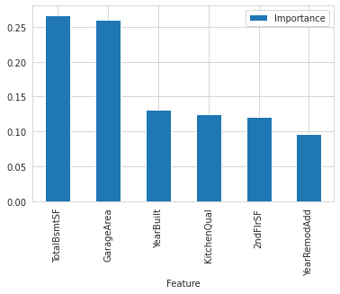

# **HouPP: Housing Price Predictor**

HouPP (Housing Price Predictor) is a Machine Learning project that helps users to predict the sales prices of houses taking the houses' attributes as inputs.

The dashboard for [HouPP is hosted on Heroku](https://houpp.herokuapp.com/).

## Table of Contents

1. [Dataset Content](#1-dataset-content)
2. [Business Requirements](#2-business-requirements)
    - [Epics](#epics)
    - [User Stories](#user-stories)
3. [Hypotheses and validation](#3-hypotheses-and-validation)
4. [Rationale to map the business requirements to the Data Visualizations and ML tasks](#4-rationale-to-map-the-business-requirements-to-the-data-visualizations-and-ml-tasks)
5. [ML Business Case](#5-ml-business-case)
6. [Dashboard Design](#6-dashboard-design)
   - [Page 1: Quick project summary](#page-1-quick-project-summary)
   - [Page 2: House prices Correlation Study](#page-2-house-prices-correlation-study)
   - [Page 3: Project hypotheses and validation](#3-hypotheses-and-validation)
   - [Page 4: Predict House price](#page-4-predict-house-price)
   - [Page 5: ML: House Price Predictor](#page-5-ml-house-price-predictor)
7. [Unfixed Bugs](#7-unfixed-bugs)
8. [Deployment](#8-deployment)
9. [Main Data Analysis and Machine Learning Libraries](#9-main-data-analysis-and-machine-learning-libraries)
10. [Credits](#10-credits)

## **1. Dataset Content**

* The dataset for this project is sourced from [Kaggle](https://www.kaggle.com/codeinstitute/housing-prices-data). We created then a fictitious user story where predictive analytics can be applied in a real project in the workplace. 

* The dataset has almost 1.5 thousand rows and represents housing records from Ames, Iowa. The dataset has 22 features indicating house profile (Floor Area, Basement, Garage, Kitchen, Lot, Porch, Wood Deck, Year Built) and its respective sale price for houses built between 1872 and 2010.

The table below indicates the variables, their description and units of measurement. We note that some variables are numerical while others are categorical.

|Variable|Meaning|Units|
|:----|:----|:----|
|1stFlrSF|First Floor square feet|334 - 4692|
|2ndFlrSF|Second floor square feet|0 - 2065|
|BedroomAbvGr|Bedrooms above grade (does NOT include basement bedrooms)|0 - 8|
|BsmtExposure|Refers to walkout or garden level walls|Gd: Good Exposure; Av: Average Exposure; Mn: Mimimum Exposure; No: No Exposure; None: No Basement|
|BsmtFinType1|Rating of basement finished area|GLQ: Good Living Quarters; ALQ: Average Living Quarters; BLQ: Below Average Living Quarters; Rec: Average Rec Room; LwQ: Low Quality; Unf: Unfinshed; None: No Basement|
|BsmtFinSF1|Type 1 finished square feet|0 - 5644|
|BsmtUnfSF|Unfinished square feet of basement area|0 - 2336|
|TotalBsmtSF|Total square feet of basement area|0 - 6110|
|GarageArea|Size of garage in square feet|0 - 1418|
|GarageFinish|Interior finish of the garage|Fin: Finished; RFn: Rough Finished; Unf: Unfinished; None: No Garage|
|GarageYrBlt|Year garage was built|1900 - 2010|
|GrLivArea|Above grade (ground) living area square feet|334 - 5642|
|KitchenQual|Kitchen quality|Ex: Excellent; Gd: Good; TA: Typical/Average; Fa: Fair; Po: Poor|
|LotArea| Lot size in square feet|1300 - 215245|
|LotFrontage| Linear feet of street connected to property|21 - 313|
|MasVnrArea|Masonry veneer area in square feet|0 - 1600|
|EnclosedPorch|Enclosed porch area in square feet|0 - 286|
|OpenPorchSF|Open porch area in square feet|0 - 547|
|OverallCond|Rates the overall condition of the house|10: Very Excellent; 9: Excellent; 8: Very Good; 7: Good; 6: Above Average; 5: Average; 4: Below Average; 3: Fair; 2: Poor; 1: Very Poor|
|OverallQual|Rates the overall material and finish of the house|10: Very Excellent; 9: Excellent; 8: Very Good; 7: Good; 6: Above Average; 5: Average; 4: Below Average; 3: Fair; 2: Poor; 1: Very Poor|
|WoodDeckSF|Wood deck area in square feet|0 - 736|
|YearBuilt|Original construction date|1872 - 2010|
|YearRemodAdd|Remodel date (same as construction date if no remodeling or additions)|1950 - 2010|
|SalePrice|Sale Price|34900 - 755000|
#

### **Project Terms and Jargon**

* **Sale price** of a house refers to the current market price of a house with certain attributes.

* **Inherited house** is a house that the client inheritted from grandparents.

* **Summed price** is the total of the sale prices of the four inheritted houses.

## **2. Business Requirements**
Our client, who has received an inheritance from a deceased great-grandfather located in Ames, Iowa, has requested us to  help in maximizing the sales price for the inherited properties.

Although our client has an excellent understanding of property prices in her own state and residential area, she fears that basing her estimates for property worth on her current knowledge might lead to inaccurate appraisals. What makes a house desirable and valuable where she comes from might not be the same in Ames, Iowa. 

Our client found a public dataset with house prices for Ames, Iowa, and has provide us with that.

We have agreed with our client on the following business requirements.

* 1 - (BR1) The client is interested in discovering how the house attributes correlate with the sale price. Therefore, the client expects data visualizations of the correlated variables against the sale price to show that.

* 2 - (BR2) The client is interested to predict the house sales price from her 4 inherited houses, and any other house in Ames, Iowa.

In order to address the business requirements, we have the following epics and user stories. Each user story was then broken down to manageable stasks, and the agile process was used to implement each task. 

### Epics

* Information gathering and data collection.

* Data visualization, cleaning, and preparation.

* Model training, optimization and validation.

* Dashboard planning, designing, and development.

* Dashboard deployment and release.

### User Stories

* **US1:** As a client, I want to know which attributes of a house are most correlated with its sale price so that I can base my prediction on the the right set of features.(*Business Requirement Covered: BR1*)

* **US2:** As a client, I want to have reliable prediction of the sale price of houses I have inherited so that I can sell them at the maximum total price possible. (*Business Requirement Covered: BR2*)

* **US3:** As a technical user, I want to learn about the ML steps that were used to arrive at the sale price prediction so that I can understand the model employed.(*Business Requirement Covered: BR2*)

* **US4:** As a technical user, I want to know the model performance so that I can ensure that the predictions are reliable. (*Business Requirement Covered: BR2*)

* **US5:** As a client, I want to get a dashboard so that I can display the results of the prediction on a standalone app.

* **US6:** As a user, I want to have interactive input widgets so that I can provide real-time house data and predict the sale price. (*Business Requirement Covered: BR2*)

* **US7:** As a user, I want to see relevant plots so that I can visualize the relationships between sale price and other features. (*Business Requirement Covered: BR1*)

* **US8:** As a user, I want to have access to the data cleaning and preparation pipeline so that I can quickly predict sale price without reinventing the wheel.

* **US9:** As a user, I want to know the source and content of the data used in training the model so that I can be confident about the quality of the trained model.

* **US10:** As a user, I want to know the project hypotheses and how they were validated so that I get a deeper understand of the mechanisms that determine sale price. 

## **3. Hypotheses and validation**

1. Size matters. Variables that are associated with the size of the house are positively correlated to sale price.

   * We will examine correlations between attributes about the size of the house and the sale price.

2. Ratings of the quality and condition of the house reflect its value and thus higher ratings indicate higher sale price.

   * We will use the correlation between variables about the different ratings of the house and the sale price to validate this hypothesis.

3. Age of the house is expected to have significant influence on the sale price of the house.

   * We study when the house was built and how expensive it is to test this hypothesis.

## **4. Rationale to map the business requirements to the Data Visualizations and ML tasks**

* **Business Requirement 1:** Data Visualization and Correlation study

  * We will inspect the sale price of the houses in the data and plot a histogram to understand its distribution.

  * We will study the magnitudes and directions of correlation between the attributes and sale price of the houses. We will compute both Peason and Spearman correlations.

  * We will plot the key variables against the sale price of the houses to illustrate the nature of relationship.

  * The [correlation study notebook](https://github.com/Amareteklay/heritage-housing-issues/blob/main/jupyter_notebooks/03%20-%20Correlation_Study.ipynb) handles this business requirement.

* **Business Requirement 2:** Regression Analysis

  * As the target variable we are interested to predict is continuous, we will use regression analysis to address this business requirement. In case the performance of our regression model is poor, we may change this to a classification problem.

  * Not all attributes will have the same effect on the sale price. We want to identify variables that contribute to the lion's share of the price so that our customer can maximize price by leveraging these factors. We may use PCA to identify these variables.

  * The [Modeling and Evaluation - Predict House Prices notebook](https://github.com/Amareteklay/heritage-housing-issues/blob/main/jupyter_notebooks/05%20-%20Modeling%20and%20Evaluation%20-%20Predict%20House%20Prices.ipynb) handles this business requirement.

## **5. ML Business Case**

### **Predict Sale Price**
#### **Regression Model**

* We want an ML model to predict sale price of a house with several attributes. As our target variable is a discrete number, we consider a **regression model**, which is supervised and uni-dimensional.

* Our ideal outcome is to provide our client with reliable insight into house attributes that maximize its sale price.

* The model success metrics are

	* At least 0.75 for R2 score, on train and test set

	* The ML model is considered a failure if:

		* for a given house, the model's predictions are off more than 25% of the time.

* The output is defined as a continuous value for sale price in USD. It is assumed that this model will predict sale price of a house whose relevant attributes are known. Inherited houses have known attributes, and their sale prices are predicted by the model. For live prediction of sale price of a house other than the four inherited houses, the user can enter the required values for the relevant features and get the prediction in real-time.

* Heuristics: ?? .

* The training data to fit the model come from a public dataset in Ames, Iowa. This dataset contains about 1.5 thousand house price records.

	* Train data: drop variables EnclosedPorch and WooddeckSF because each has more than 75% missing values. 

  * Target: sale price 

  * features: all other variables, except 

## **6. Dashboard Design**

### **Page 1: Quick project summary**

This page shows a quick summary of

* the project's key terms and jargon

* the project dataset

* the business requirements

### **Page 2: House prices Correlation Study**

This page shows
* the business requirement that was handled by correlation study.
* a checkbox for inspecting the dataset
* a listing of findings related to which features have the strongest correlation to the house sale price.
* a checkbox for displaying plots of sale price and each of the features that have strong correlation. This section of the page displays:
  * scatter plots of sale price and each of the continuous numerical features
  * box plots of sale price and each of the categorical features
  * line graphs of sale price and each of the time variables

### **Page 3: Project hypotheses and validation**

1. Size matters. Variables that are associated with the size of the house are positively correlated to sale price.

   * We will examine correlations between attributes about the size of the house and the sale price.

2. Ratings of the quality and condition of the house reflect its value and thus higher ratings indicate higher sale price.

   * We will use the correlation between variables about the different ratings of the house and the sale price to validate this hypothesis.

3. Age of the house is expected to have significant influence on the sale price of the house.

   * We study when the house was built and how expensive it is to test this hypothesis.

### **Page 4: Predict House price**

* State business requirement 2

  * The client is interested in predicting the house sale prices from her 4 inherited houses, and any other house in Ames, Iowa.

* This page displays the 4 houses' attributes and their respective predicted sale price. 

* It displays a message informing the summed predicted price for all 4 inherited houses. 

* Set of interactive input widgets that allow a user to provide real-time house data to predict the sale price.

* "Predict Sale Price" button that serves the new house data to our ML pipelines, and predicts the sale price of the house.

### **Page 5: ML: House Price Predictor**

This page presents:

* considerations and conclusions after the pipeline was trained

* the ML pipeline steps

* feature importance (both a list and a plot)

* pipeline performance of the regression model

Feature Importance

## **7. Unfixed Bugs**

* There were no known unfixed bugs in this project.

## **8. Deployment**

### **Heroku**

* The App live link is: https://houpp.herokuapp.com/

  * **Note:** *At the time of writing this document, Heroku has notified users that apps in the free tier may not be served as of 28th November 2022. So the above link may not work.*

* The project was deployed to Heroku using the following steps.

1. Log in to Heroku and create an App

2. At the Deploy tab, select GitHub as the deployment method.

3. Select your repository name and click Search. Once it is found, click Connect.

4. Select the branch you want to deploy, then click Deploy Branch.

5. The deployment process should happen smoothly in case all deployment files are fully functional. Click now the button Open App on the top of the page to access your App.

## **9. Main Data Analysis and Machine Learning Libraries**

* Here is a list of the libraries I used in the project. The version number of each library can be found in the [requirements file](https://github.com/Amareteklay/heritage-housing-issues/blob/main/requirements.txt) of this project.

* Numpy was used to generate arrays of random numbers such as the mask of zeros used in the correlation heatmaps.

* Pandas: to convert CSV data to DataFrame and make data management and manipulation with the help of builtin functionalities easier. 

* Scikit-learn: was used to train and evaluate the ML model that was then used to predict sale price. The training involves cross validation and hyperparameter optimization in an effort to identify the most appropriate model and specify the optimal parameters that enhance model performance.

* Matplot-lib was used to generate different types of plots.

* Seaborn was used to create statistical graphs such as heatmaps. It augments the functionalities of matplot-lib.

* Jupyter: an interactive environment to create the notebooks where I collect data, clean the data, conduct correlation study, do feature engineering, train and evaluate ML model. 

* StreamLit: to create a dashboard with important information organized in separate pages and an interactive UI for predicting sale price of a house.

* pandas-profiling was used to inspect each variable in the dataset to better understand the data and identify potential need for data cleaning.
* ppscore was used to calculate the relationships between different pairs of variables in the dataset irrespective of the data type of each variable.
* feature-engine was used to conduct feature engineering to prepare the dataset for the machine learning process. For example, I used feature-engine to encode and transform variables.

## **10. Credits**
 
### **Code**

- I have reused and adapted code from different sections of the course as well as the walk through projects.

- Specific locations of the sources of the code are referred to in inline comments and doc strings in each notebook or python file.

 
### **Content**

- The outline of this documentation was taken from the accompanying (to the project) [code repository](https://github.com/Code-Institute-Solutions/milestone-project-heritage-housing-issues) provided by the [Code Institute](https://codeinstitute.net).  

- The icon in the dashboard app was taken from [this page](https://twemoji.maxcdn.com/2/test/preview.html) 

### **Acknowledgements**

* I would like to thank my mentor, Mo Shami, for his kind support and inspiring comments.

